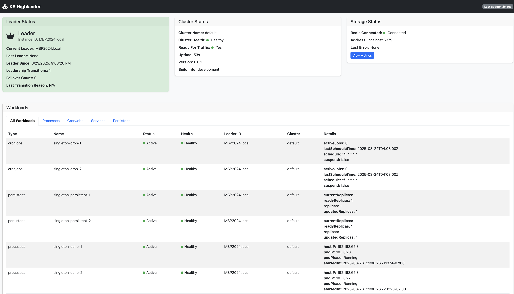
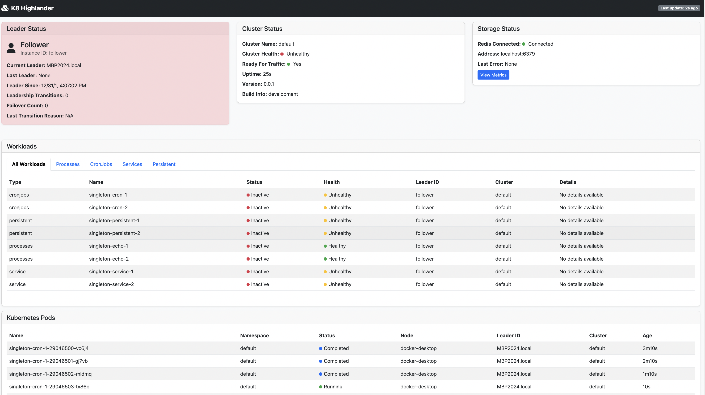

# K8 Highlander for Kubernetes

[](https://goreportcard.com/report/github.com/bhatti/k8-highlander)
[](https://github.com/bhatti/k8-highlander/blob/main/LICENSE)
[](https://hub.docker.com/r/plexobject/k8-highlander)

K8 Highlander allows managing singleton or stateful processes in Kubernetes clusters where only one instance of a 
service should exist at any time. It provides leader election, automatic failover, and management of various 
workload types with reliability.

## 🌟 Features

- **Leader Election**: Ensures only one controller instance is active at a time
- **Automatic Failover**: Seamlessly transitions workloads when the active instance fails
- **Multiple Workload Types**: Supports processes, cron jobs, services, and stateful sets
- **Multi-Tenant Support**: Run multiple isolated controller groups with separate leadership
- **Monitoring Dashboard**: Real-time visibility into controller and workload status
- **Prometheus Metrics**: Comprehensive metrics for monitoring and alerting
- **Storage Options**: Supports Redis or relational database for leader state storage
- **CRD Synchronization**: Dynamically add, update, or remove workloads via Kubernetes CRDs

## 🚀 Use Cases

K8 Highlander is designed for scenarios where you need to ensure only one instance of a 
process is running across your Kubernetes cluster:

### Process Workloads

- **Single-instance processes** like sequential ID generators
- **Data Capture** that should not have duplicate instances
- **Batch processors** that need exclusive access to resources
- **Legacy applications** that weren't designed for horizontal scaling

```yaml
processes:
  - name: "data-processor"
    image: "mycompany/data-processor:latest"
    script:
      commands:
        - "echo 'Starting data processor'"
        - "/app/process-data.sh"
      shell: "/bin/sh"
    env:
      DB_HOST: "postgres.example.com"
    resources:
      cpuRequest: "200m"
      memoryRequest: "256Mi"
    restartPolicy: "OnFailure"
```

### Cron Job Workloads

- **Scheduled tasks** that should run exactly once
- **Periodic cleanup jobs** that shouldn't overlap
- **Report generation** on a schedule
- **Data synchronization** tasks

```yaml
cronJobs:
  - name: "daily-report"
    schedule: "0 0 * * *"  # Daily at midnight
    image: "mycompany/report-generator:latest"
    script:
      commands:
        - "echo 'Generating daily report'"
        - "/app/generate-report.sh"
      shell: "/bin/sh"
    env:
      REPORT_TYPE: "daily"
    restartPolicy: "OnFailure"
```

### Service Workloads (Deployments)

- **API servers** that need to be singleton but highly available
- **Web interfaces** for admin tools
- **Job managers** that coordinate work
- **Middleware components** that require singleton behavior

```yaml
services:
  - name: "admin-api"
    image: "mycompany/admin-api:latest"
    replicas: 1
    ports:
      - name: "http"
        containerPort: 8080
        servicePort: 80
    env:
      LOG_LEVEL: "info"
    resources:
      cpuRequest: "100m"
      memoryRequest: "128Mi"
```

### Persistent Workloads (StatefulSets)

- **Databases** that should only have one primary instance
- **Message queues** like messaging servers that need stable network identity
- **Cache servers** with persistent storage
- **Stateful applications** requiring ordered, graceful scaling

```yaml
persistentSets:
  - name: "message-queue"
    image: "ibmcom/mqadvanced-server:latest"
    replicas: 1
    ports:
      - name: "mq"
        containerPort: 1414
        servicePort: 1414
    persistentVolumes:
      - name: "data"
        mountPath: "/var/mqm"
        size: "10Gi"
    env:
      LICENSE: "accept"
      MQ_QMGR_NAME: "QM1"
    resources:
      cpuRequest: "500m"
      memoryRequest: "1Gi"
```

## 📋 Installation

### Prerequisites

- Kubernetes cluster (v1.16+)
- Redis server or PostgreSQL database for leader state storage
- kubectl configured to access your cluster

### Using Helm

```bash
# Add the Helm repository
helm repo add k8-highlander https://bhatti.github.io/k8-highlander-charts
helm repo update

# Install the chart
helm install k8-highlander k8-highlander/k8-highlander \
  --namespace k8-highlander \
  --create-namespace \
  --set redis.addr=my-redis:6379
```

### Using kubectl

```bash
# Create namespace
kubectl create namespace k8-highlander

# Create config map
kubectl create configmap k8-highlander-config \
  --from-file=config.yaml=./config/config.yaml \
  -n k8-highlander

# Apply deployment
kubectl apply -f https://raw.githubusercontent.com/bhatti/k8-highlander/main/deploy/kubernetes/deployment.yaml
```

### Using Docker

```bash
docker run -d --name k8-highlander \
  -v $(pwd)/config.yaml:/etc/k8-highlander/config.yaml \
  -e HIGHLANDER_REDIS_ADDR=redis-host:6379 \
  -p 8080:8080 \
  plexobject/k8-highlander:latest
```

## 🔧 Configuration

K8 Highlander can be configured using a YAML configuration file and/or environment variables.

### Configuration File

```yaml
# config.yaml
id: ""  # Will use hostname if empty
tenant: "default"
port: 8080
namespace: "default"

# Storage configuration
storageType: "redis"  # "redis" or "db"
redis:
  addr: "redis-host:6379"
  password: ""
  db: 0
databaseURL: ""  # Used if storageType is "db"

# Cluster configuration
cluster:
  name: "primary"
  kubeconfig: ""  # Will use in-cluster config if empty

# Workloads configuration
workloads:
  processes:
    - name: "example-process"
      # ... process configuration ...

  cronJobs:
    - name: "example-cronjob"
      # ... cron job configuration ...

  services:
    - name: "example-service"
      # ... service configuration ...

  persistentSets:
    - name: "example-persistent"
      # ... persistent set configuration ...
```

### Environment Variables

| Variable | Description | Default |
|----------|-------------|---------|
| `HIGHLANDER_ID` | Controller ID | Hostname |
| `HIGHLANDER_TENANT` | Tenant name | `default` |
| `HIGHLANDER_PORT` | HTTP server port | `8080` |
| `HIGHLANDER_STORAGE_TYPE` | Storage type (`redis` or `db`) | `redis` |
| `HIGHLANDER_REDIS_ADDR` | Redis server address | `localhost:6379` |
| `HIGHLANDER_REDIS_PASSWORD` | Redis server password | `""` |
| `HIGHLANDER_REDIS_DB` | Redis database number | `0` |
| `HIGHLANDER_DATABASE_URL` | Database connection URL | `""` |
| `HIGHLANDER_KUBECONFIG` | Path to kubeconfig file | `""` |
| `HIGHLANDER_CLUSTER_NAME` | Cluster name | `default` |
| `HIGHLANDER_NAMESPACE` | Kubernetes namespace | `default` |

## 📊 Monitoring

K8 Highlander provides a built-in dashboard and Prometheus metrics for monitoring.

### Dashboard

Access the dashboard at `http://<controller-address>:8080/`




### Prometheus Metrics

Metrics are exposed at `http://<controller-address>:8080/metrics`

Key metrics include:

- `k8_highlander_is_leader`: Indicates if this instance is the leader (1) or not (0)
- `k8_highlander_leadership_transitions_total`: Total number of leadership transitions
- `k8_highlander_workload_status`: Status of managed workloads (1=active, 0=inactive)
- `k8_highlander_failover_total`: Total number of failovers
- `k8_highlander_redis_operations_total`: Total number of Redis operations

## 🔍 Troubleshooting

### Common Issues

#### Controller Not Becoming Leader

- Check Redis connectivity: `redis-cli -h <redis-host> ping`
- Verify Redis keys: `redis-cli -h <redis-host> keys "highlander-leader-*"`
- Check controller logs: `kubectl logs -l app=k8-highlander -n k8-highlander`

#### Workloads Not Starting

- Check controller logs for errors
- Verify RBAC permissions: The controller needs permissions to create/update/delete pods, deployments, etc.
- Check workload configuration for errors

#### Failover Not Working

- Ensure multiple controller instances are running
- Check Redis connectivity from all instances
- Verify leader lock TTL settings (default: 15s)

### Debugging

Enable debug logging by setting the environment variable:

```bash
HIGHLANDER_LOG_LEVEL=debug
```

Access detailed status information:

```bash
curl http://<controller-address>:8080/debug/status
```

## 🧪 Examples

### Basic Setup with Process Workload

```yaml
# config.yaml
id: "controller-1"
tenant: "default"
namespace: "default"

redis:
  addr: "redis:6379"

workloads:
  processes:
    - name: "singleton-processor"
      image: "busybox:latest"
      script:
        commands:
          - "echo 'Starting singleton processor'"
          - "while true; do echo 'Processing...'; sleep 60; done"
        shell: "/bin/sh"
      resources:
        cpuRequest: "100m"
        memoryRequest: "64Mi"
      restartPolicy: "Never"
```

### Multi-Tenant Setup

```yaml
# controller-1.yaml
id: "controller-1"
tenant: "tenant-a"  # First tenant
namespace: "tenant-a"

redis:
  addr: "redis:6379"

workloads:
  processes:
    - name: "tenant-a-processor"
      # ... configuration ...
```

```yaml
# controller-2.yaml
id: "controller-2"
tenant: "tenant-b"  # Second tenant
namespace: "tenant-b"

redis:
  addr: "redis:6379"

workloads:
  processes:
    - name: "tenant-b-processor"
      # ... configuration ...
```

### High Availability Setup

```yaml
# Deploy multiple instances with the same tenant
apiVersion: apps/v1
kind: Deployment
metadata:
  name: k8-highlander
  namespace: k8-highlander
spec:
  replicas: 2  # Run two instances for HA
  selector:
    matchLabels:
      app: k8-highlander
  template:
    metadata:
      labels:
        app: k8-highlander
    spec:
      containers:
      - name: controller
        image: plexobject/k8-highlander:latest
        env:
        - name: HIGHLANDER_TENANT
          value: "production"
        - name: HIGHLANDER_REDIS_ADDR
          value: "redis:6379"
        # ... other configuration ...
```

## 🔄 CRD Synchronization

K8 Highlander includes powerful support for dynamically managing workloads through Kubernetes Custom Resource Definitions (CRDs). This allows you to add, update, or remove workloads without restarting the controller or modifying its configuration file.

### CRD Types

K8 Highlander supports four types of CRDs corresponding to the four workload types:

1. **WorkloadProcess** - For singleton processes
2. **WorkloadCronJob** - For scheduled jobs
3. **WorkloadService** - For deployments with services
4. **WorkloadPersistent** - For stateful sets

### Setting Up CRD Integration

#### Step 1: Install the CRDs

Apply the CRD definitions to your Kubernetes cluster:

```bash
kubectl apply -f config/highlander-crds.yaml
```

#### Step 2: Configure RBAC Permissions

Ensure K8 Highlander has the necessary permissions to watch and manage CRDs:

```yaml
apiVersion: rbac.authorization.k8s.io/v1
kind: ClusterRole
metadata:
  name: k8-highlander-crd-role
rules:
- apiGroups: ["highlander.plexobject.io"]
  resources: ["workloadprocesses", "workloadcronjobs", "workloadservices", "workloadpersistents"]
  verbs: ["get", "list", "watch", "create", "update", "patch", "delete"]
```

### Automatic CRD Sync

The key advantage of K8 Highlander's CRD implementation is its automatic synchronization:

- **Zero Configuration**: The controller automatically detects and synchronizes with CRD instances
- **No Manual Referencing**: No need to explicitly reference CRDs in the K8 Highlander configuration
- **Real-time Detection**: Changes to CRDs are detected and applied immediately
- **Leader-Aware**: Only the active leader processes CRD changes, preventing duplication

Simply add, update, or delete CRD instances, and K8 Highlander automatically handles the rest.

### Managing Workloads with CRDs

#### Adding a New Workload

Create a CRD resource to add a new workload:

```yaml
apiVersion: highlander.plexobject.io/v1
kind: WorkloadCronJob
metadata:
  name: sample-cronjob
  namespace: default
spec:
  image: "busybox:latest"
  script:
    commands:
      - "echo 'Running CRD-defined cron job at $(date)'"
      - "echo 'Hostname: $(hostname)'"
      - "sleep 15"
    shell: "/bin/sh"
  schedule: "*/5 * * * *"
  env:
    TEST_ENV: "crd-value"
    CRD_DEFINED: "true"
  resources:
    cpuRequest: "50m"
    memoryRequest: "32Mi"
    cpuLimit: "100m"
    memoryLimit: "64Mi"
  restartPolicy: "OnFailure"
```

You can apply this with:

```bash
kubectl apply -f sample-cronjob.yaml
```

K8 Highlander will automatically detect this new CRD instance and create the corresponding workload.

#### Updating a Workload

Simply update the CRD resource, and K8 Highlander will automatically detect and apply the changes:

```bash
kubectl edit workloadcronjob sample-cronjob
```

#### Removing a Workload

Delete the CRD resource to remove the workload:

```bash
kubectl delete workloadcronjob sample-cronjob
```

K8 Highlander will detect the deletion and safely shut down and remove the corresponding workload.

### Using Helper Scripts

K8 Highlander includes helper scripts to simplify CRD management:

#### Create a CronJob Workload

```bash
./scripts/create-cronjob-crd.sh --name=my-cronjob --namespace=default \
  --image=busybox:latest --schedule="*/5 * * * *"
```

The script supports the following parameters:

```
--name             # Required: Name of the CronJob
--namespace        # Optional: Namespace (default: "default")
--image            # Optional: Container image (default: "busybox:latest")
--shell            # Optional: Shell for the script (default: "/bin/sh")
--schedule         # Optional: Cron schedule (default: "*/1 * * * *")
--restart-policy   # Optional: Restart policy (default: "OnFailure")
--cpu-request      # Optional: CPU request (default: "50m")
--memory-request   # Optional: Memory request (default: "32Mi")
--cpu-limit        # Optional: CPU limit (default: "100m")
--memory-limit     # Optional: Memory limit (default: "64Mi")
```

#### Delete a Workload

```bash
./scripts/delete-workload-crd.sh --name=my-cronjob --kind=WorkloadCronJob
```

The script supports the following parameters:

```
--name       # Required: Name of the workload
--namespace  # Optional: Namespace (default: "default")
--kind       # Required: One of WorkloadProcess, WorkloadCronJob, WorkloadService, or WorkloadPersistent
```

### Monitoring CRD Workloads

CRD-managed workloads appear in the K8 Highlander dashboard like any other workload. You can also check their status with:

```bash
kubectl get workloadprocesses
kubectl get workloadcronjobs
kubectl get workloadservices
kubectl get workloadpersistents
```

Each resource includes status fields showing whether it's active and healthy:

```
NAME           ACTIVE   HEALTHY   AGE
sample-cronjob true     true      5m
```

### GitOps Integration

K8 Highlander's CRD support enables seamless GitOps workflows:

1. **Declarative Workload Management**: Define workloads as Kubernetes resources stored in Git
2. **Automated Deployment**: Use CI/CD systems to apply workload CRDs to your cluster
3. **Version Control**: Track workload changes through Git history
4. **Pull Request Workflow**: Review workload changes before they're applied
5. **Automatic Synchronization**: No additional steps to inform K8 Highlander of changes

### CRD Synchronization Architecture

K8 Highlander's CRD synchronization works through the following mechanism:

1. **CRD Watcher**: Continuously monitors for changes to CRD resources
2. **Dynamic Registration**: Automatically registers new workloads when CRDs are created
3. **Real-time Updates**: Applies changes to workloads when CRDs are updated
4. **Clean Removal**: Safely shuts down and removes workloads when CRDs are deleted
5. **Leader-Aware**: Only the active leader instance processes CRD changes
6. **State Recovery**: Recovers workload state after leader changes

This architecture ensures seamless synchronization between Kubernetes CRDs and K8 Highlander workloads, enabling GitOps workflows and external management of singleton workloads.

## 🤝 Contributing

Contributions are welcome! Please feel free to submit a Pull Request.

1. Fork the repository
2. Create your feature branch (`git checkout -b feature/amazing-feature`)
3. Commit your changes (`git commit -m 'Add some amazing feature'`)
4. Push to the branch (`git push origin feature/amazing-feature`)
5. Open a Pull Request

## 📜 License

This project is licensed under the MIT License - see the [LICENSE](LICENSE) file for details.

## 🌟 Why K8 Highlander?

### The Problem

Kubernetes is designed for stateless applications that can scale horizontally. 
However, many real-world applications require singleton behavior where exactly one instance should 
be running at any time. Examples include:

- Legacy applications not designed for horizontal scaling
- Processes that need exclusive access to resources
- Scheduled jobs that should run exactly once
- Primary/replica database setups where only one primary should exist

Traditional solutions like Kubernetes StatefulSets provide stable network identities but don't solve 
the "exactly-one-active" problem across multiple nodes or clusters.

### The Solution

K8 Highlander provides:

1. **Leader Election**: Ensures only one controller is active at a time
2. **Automatic Failover**: If the active controller fails, another takes over
3. **Workload Management**: Manages different types of workloads with singleton behavior
4. **Multi-Tenant Support**: Run multiple isolated controller groups
5. **Monitoring and Metrics**: Real-time visibility into controller and workload status

By handling the complexity of leader election and workload management, K8 Highlander allows you to 
run stateful workloads in Kubernetes with confidence, knowing that exactly one instance will be active at any time.

---

## 📚 Further Reading

- [Architecture Overview](docs/architecture.md)
- [API Reference](docs/api-reference.md)
- [Configuration Reference](docs/configuration.md)
- [Metrics Reference](docs/metrics.md)
- [Deployment Strategies](docs/deployment.md)

---

Sponsored by [PlexObject Solutions, Inc.](https://plexobject.com) and made with ❤️ for the Kubernetes community.
