# Architecture Overview

The K8 Highlander is designed to provide reliable singleton workload management in Kubernetes clusters. 
This document explains the architecture, components, and interactions of the system.

## System Components

The K8 Highlander consists of several key components:

1. **Leader Election**: Ensures only one controller instance is active at a time
2. **Workload Manager**: Manages different types of workloads
3. **Monitoring Server**: Provides metrics and status information
4. **HTTP Server**: Serves the dashboard and API endpoints

## High-Level Architecture

The following diagram shows the high-level architecture of the K8 Highlander:

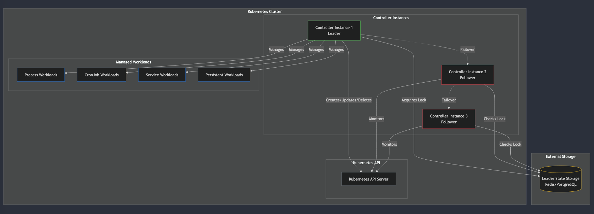
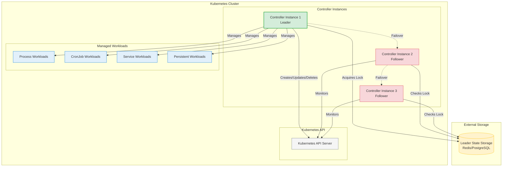

## Leader Election Process

The leader election process ensures that only one controller instance is active at a time. 
This is critical for preventing duplicate workloads.

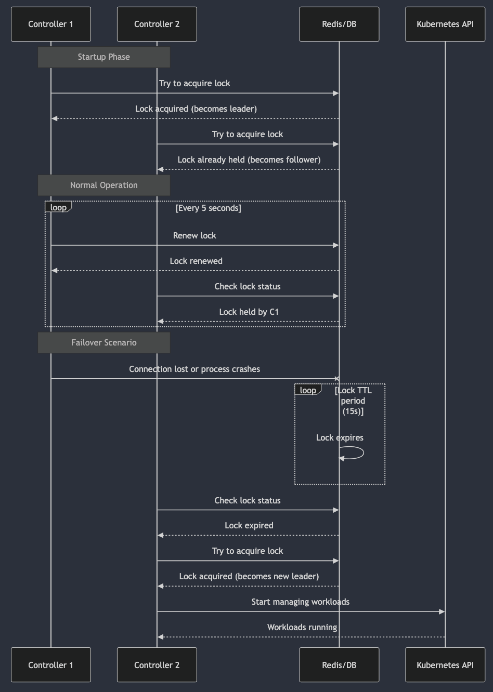
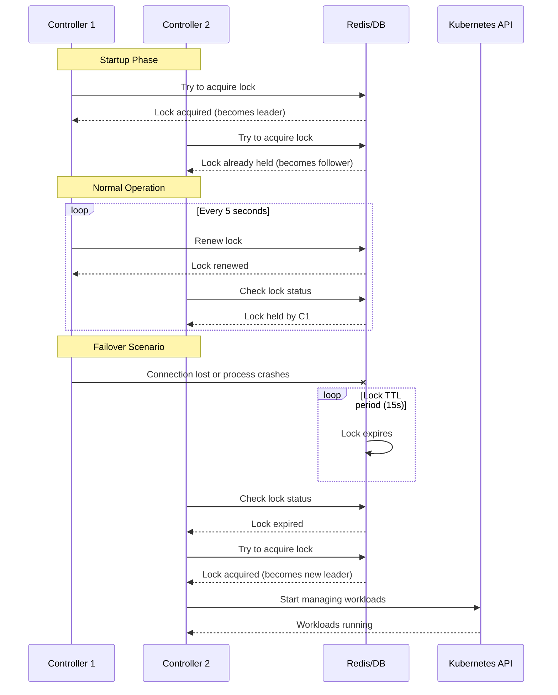

## Workload Management

The Workload Manager is responsible for creating, updating, and deleting workloads in the Kubernetes cluster. 
It supports different types of workloads:
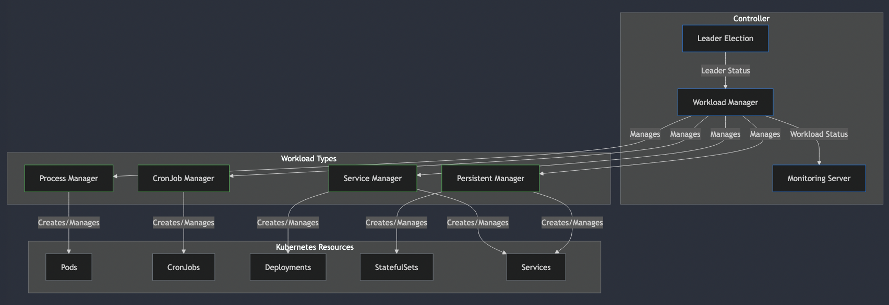

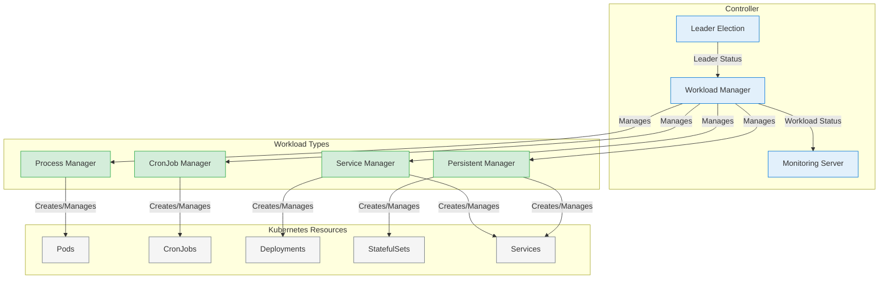

### Workload Types

1. **Process Workloads**: Single-instance processes running in pods
2. **CronJob Workloads**: Scheduled tasks that run at specified intervals
3. **Service Workloads**: Continuously running services with a specified number of replicas
4. **Persistent Workloads**: Stateful applications with persistent storage

## Multi-Tenant Architecture

The K8 Highlander supports multi-tenant deployments, where different tenants can have their own leader 
election and workload management:

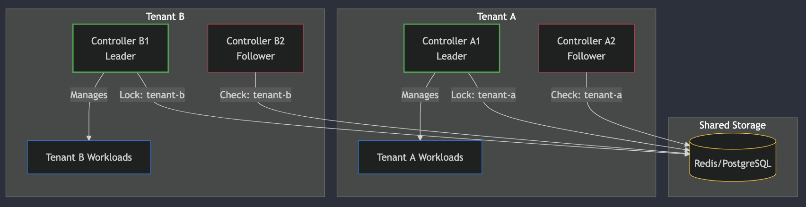

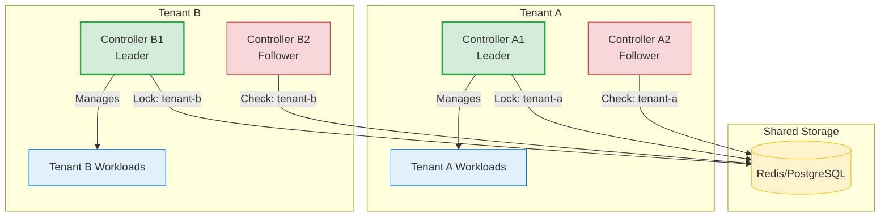

## Component Interactions

The following diagram shows the interactions between the different components of the K8 Highlander:
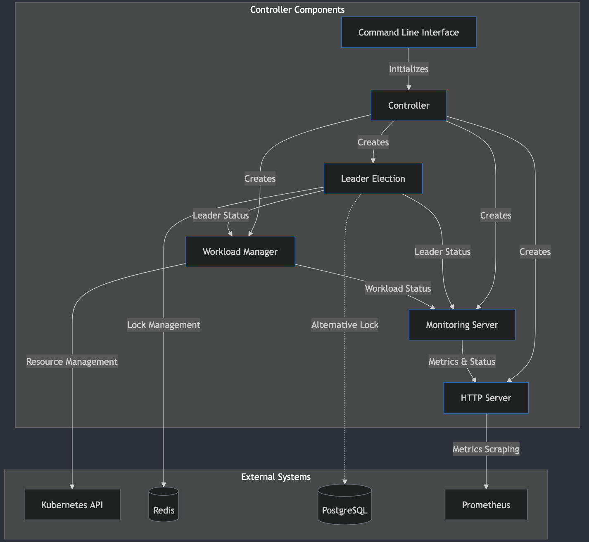

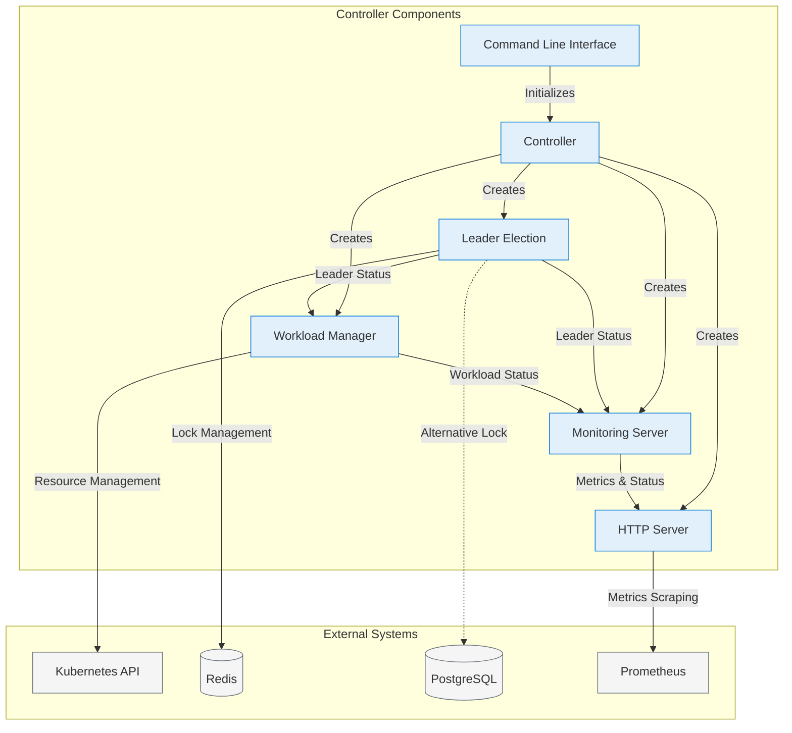

## Data Flow

The following diagram shows the data flow through the K8 Highlander:
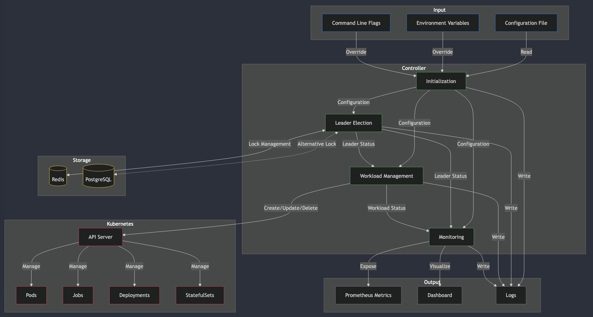

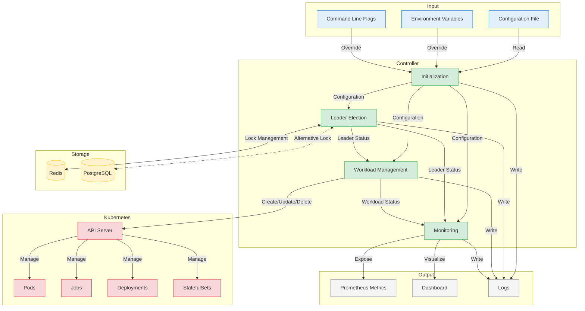

## Storage Options

The K8 Highlander supports two storage options for leader election:

1. **Redis**: Fast, in-memory storage with optional persistence
2. **PostgreSQL**: Relational database for more robust persistence

Both options provide the necessary functionality for leader election, but Redis is generally faster 
while PostgreSQL provides stronger durability guarantees.

## Failover Process

When a leader controller fails, the following process occurs:

1. The leader's lock in Redis/PostgreSQL expires after the TTL period (default: 60s)
2. Follower controllers detect the expired lock
3. One follower acquires the lock and becomes the new leader
4. The new leader starts managing workloads
5. Workloads are recreated if necessary

This process ensures high availability of the controller and the workloads it manages.

## Security Considerations

The K8 Highlander requires certain permissions to manage workloads in Kubernetes:

- Create, update, and delete pods, deployments, statefulsets, and services
- Read and write access to the configured namespace
- Access to the Redis or PostgreSQL storage

It's recommended to run the controller with the principle of least privilege, granting only the permissions 
it needs to function.

## Performance Considerations

The K8 Highlander is designed to be lightweight and efficient. However, there are some performance considerations:

- Redis is recommended for high-performance environments
- Lock TTL should be tuned based on workload startup/shutdown time, network latency and expected load
- Resource requests and limits should be set appropriately for the controller pods
- Monitoring should be enabled to track performance metrics

## Next Steps

- See the [Configuration Reference](configuration.md) for details on configuring the controller
- See the [API Reference](api-reference.md) for details on the API endpoints
- See the [Metrics Reference](metrics.md) for details on the available metrics
- See the [Deployment Strategies](deployment.md) for details on deploying the controller

